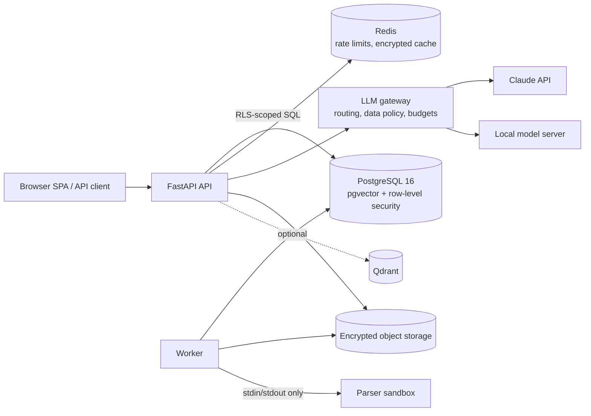

# AI Document Assistant

**Secure, multi-tenant enterprise document intelligence and RAG platform.**
Upload contracts, invoices, policies and technical documents; search them by meaning and by
keyword; ask questions and get answers that cite the exact page they came from — while every
user only ever sees the documents they are entitled to.

[](https://github.com/mojtaba-py-code/ai-document-assistant/actions/workflows/ci.yml)
[](https://github.com/mojtaba-py-code/ai-document-assistant/actions/workflows/codeql.yml)


---

## Why this is not a toy RAG demo

| Typical RAG demo | This platform |
|---|---|
| One user, one vector index | Many organisations, departments, roles, clearances and per-document grants |
| Retrieve top-k, then filter what the user may see | Authorization is compiled **into the SQL** of every search, and PostgreSQL row-level security enforces the tenant boundary underneath it |
| The prompt says "ignore instructions in documents" | The answering model has **no tools**; sources are nonce-delimited and escaped; injected passages are scored and excluded; every citation quote is **verified in code** |
| Everything goes to the LLM API | Data governance: RESTRICTED text never leaves for an external provider (LLM *or* embeddings); PII is pseudonymised before external calls |
| "Which contracts expire in 90 days?" answered by the LLM | Answered **deterministically** from extracted fields — exact dates, page citations, no model call |
| Parsers run in the web process | Untrusted files are parsed in a secret-free, resource-limited subprocess; macros, PDF JavaScript and zip bombs are quarantined |

## Features

**Document management** — secure upload (PDF, DOCX, XLSX, CSV, TXT, Markdown) with magic-byte
validation, zip-bomb checks, active-content and ClamAV scanning, quarantine, envelope
encryption at rest, versions, per-document grants, legal hold, retention, URL import behind an
SSRF-safe egress allowlist.

**Document AI** — sandboxed parsing that keeps headings, tables and pages; optional OCR;
structure-aware chunking; document-type classification; sensitivity detection that can only
*raise* a classification; rules and LLM extraction of parties, dates, payment terms,
amounts and invoice fields, each tied to a verified evidence quote.

**Search** — PostgreSQL full-text search, pgvector (HNSW) or Qdrant semantic search,
reciprocal-rank fusion, lexical reranking, MMR diversity, filters, old-version search on
request — all authorization-aware.

**Assistant** — grounded answers with verified citations and a confidence score,
"insufficient context" instead of guesses, deterministic deadline and document-finding
answers, private conversations, a bounded read-only tool-using agent, an offline evaluation
harness.

**Intelligence** — map-reduce summaries with citations, version comparison (textual diff +
field diff + constrained change summary), deadline reports, document reports, audited
CSV/JSON exports with expiring single-use links and formula-injection protection.

**Enterprise** — organisations, departments, five roles (platform admin, organisation admin,
department manager, employee, auditor), MFA, sessions with immediate revocation, a
tamper-evident HMAC audit chain with a verification API, LLM cost and token budgets,
Prometheus metrics, structured logs, background worker with retries and dead letters.

**Web UI** — a no-build single-page app for non-technical users that runs under a strict CSP
with Trusted Types; the AI-generated answer and the source evidence are shown separately.

## Architecture



* [docs/architecture.md](docs/architecture.md) — requirements, flows and architecture decisions (Level 1)
* [docs/threat-model.md](docs/threat-model.md) — STRIDE, threat register, OWASP API / Top 10 / LLM Top 10 (Level 2)
* [docs/security-architecture.md](docs/security-architecture.md) — every control by layer, security principles
* [docs/operations.md](docs/operations.md) — backup/restore, retention, key rotation, incident response, monitoring
* [docs/api.md](docs/api.md) — endpoints and error codes
* [docs/guide/](docs/guide/README.md) — the 36-level build guide
* [docs/security-audit.md](docs/security-audit.md) — final security assessment (Level 36)

## Quick start

### Option A — Docker Compose (everything, no API keys needed)

```bash
make secrets
```

```bash
make compose-up
```

Open <http://127.0.0.1:8000>. The default stack uses the offline AI providers, so nothing
leaves your machine. Seed demo tenants and documents:

```bash
docker compose exec api docassist seed-demo
```

Optional profiles: `--profile clamav` (malware scanning), `--profile qdrant`,
`--profile ollama` (local LLM); `deployment/compose/anthropic.yaml` switches the assistant to
Claude.

### Option B — Local Python

Requirements: Python 3.12+, PostgreSQL 16 with pgvector, optionally Redis.

```bash
make install
```

```bash
docassist init-env
```

Edit the three database DSNs in `.env` (API role, worker role, schema owner — see
`deployment/postgres/initdb/`), then:

```bash
docassist migrate
```

```bash
docassist seed-demo
```

```bash
docassist serve
```

Run the worker in a second terminal with `docassist worker`. Demo account passwords are
written to a private file (mode 0600), never printed.

### Using Claude

```bash
DOCASSIST_LLM__PROVIDER=anthropic
DOCASSIST_LLM__ANTHROPIC_API_KEY_FILE=/run/secrets/anthropic_api_key
```

The gateway uses `claude-opus-5-5` for answers and `claude-haiku-4-5` for classification and
extraction (configurable), JSON-schema structured output, and server-side refusal fallbacks.
Documents above `DOCASSIST_LLM__EXTERNAL_MAX_CLASSIFICATION` (default `CONFIDENTIAL`) are
only ever sent to the local provider.

## Security at a glance

* **Tenant isolation in the database** — PostgreSQL RLS on every tenant table, fail-closed
  when context is missing, API role without `BYPASSRLS` (checked at start-up), composite
  same-tenant foreign keys.
* **One access policy, two compilations** — the same rules in Python and SQL, proven
  equivalent by a randomised differential test.
* **Least-privilege roles** — the API cannot edit audit rows or hard-delete documents.
* **Authentication** — Argon2id, lockout, MFA (TOTP), 10-minute JWTs bound to revocable
  sessions, single-use refresh tokens with reuse detection, `__Host-` cookies + CSRF header.
* **Files** — sniffing, zip inspection, macro/JavaScript detection, ClamAV, quarantine,
  AES-256-GCM envelope encryption bound to the owning record.
* **AI** — classification-based provider routing, PII pseudonymisation, spotlighted sources,
  injection scoring, no tools in the answer path, verified citations, output guard with a
  system-prompt canary, budgets and circuit breakers.
* **Audit** — append-only table, HMAC hash chain sealed by the worker, verification API.
* **Delivery** — non-root read-only containers, segmented networks, SHA-pinned CI actions,
  CodeQL, Trivy, gitleaks, pip-audit, SBOM.

## Project layout

```
src/docassist/
  core/          settings (production validator), enums, errors, Unicode hygiene, PII redaction, logging
  db/            ORM models, RLS-scoped sessions
  security/      Argon2id, JWT, envelope encryption, TOTP, SSRF guard
  authz/         RBAC matrix, principal, document policy (Python + SQL)
  audit/         audit logger, HMAC chain sealing/verification, LLM usage
  cache/         encrypted Redis cache, GCRA rate limiter
  identity/      authentication, sessions, MFA, administration
  documents/     validation, scanning, storage, versions, grants, URL import
  ingestion/     sandbox, parsers, chunking, injection scanner, classification, extraction, pipeline
  embeddings/    hashing (offline) and OpenAI-compatible providers
  search/        pgvector / Qdrant stores, keyword FTS, hybrid ranking, search service
  llm/           providers (Claude SDK, local server, offline) + governed gateway
  rag/           query analysis, secure context, answers, citations, guard, agent tools, evaluation
  intelligence/  summaries, comparison, deadlines, extraction, reports, exports
  jobs/          Postgres job queue, worker, maintenance and retention
  api/           app factory, middleware, dependencies, routers (66 operations)
  web/           single-page app (vanilla JS modules, strict CSP)
  demo/          synthetic demo tenants and golden evaluation corpus
migrations/      Alembic schema + security (RLS, roles, triggers)
deployment/      compose overrides, Kubernetes, PostgreSQL, Redis, nginx
tests/           unit, integration (real PostgreSQL), security, adversarial, llm evaluation
```

## Testing

```bash
make check
```

The database tests run against a real PostgreSQL 16 + pgvector (as the least-privileged
application role, so RLS is exercised in every test). Point `DOCASSIST_TEST_DATABASE_URL` at a
superuser DSN — `make dev-db` starts a disposable one — and run:

```bash
make test-db
```

| Suite | What it proves |
|---|---|
| `tests/unit` | crypto tamper detection, JWT forgery, SSRF bypasses, parsers, chunking properties, injection corpus, gateway policy, UI static security rules, deployment hardening |
| `tests/integration` | RLS isolation, policy equivalence, auth flows, ingestion pipeline, search authorization, RAG end to end, exports, admin, worker, audit chain |
| `tests/security` | IDOR, privilege escalation, malicious uploads, search injection, export abuse |
| `tests/adversarial` | direct and indirect prompt injection, exfiltration attempts, fake citations |
| `tests/llm` | offline evaluation harness with asserted retrieval, citation and refusal thresholds |

## Configuration

All settings are environment variables with the `DOCASSIST_` prefix (`__` for nesting), or
files via `DOCASSIST_<NAME>_FILE`. See [.env.example](.env.example) for the complete list.
In production the process refuses to start with unsafe settings (wildcard hosts, exposed API
docs, plain-HTTP database, no malware scanner, weak or placeholder secrets, …).

## License

MIT — see [LICENSE](LICENSE).
