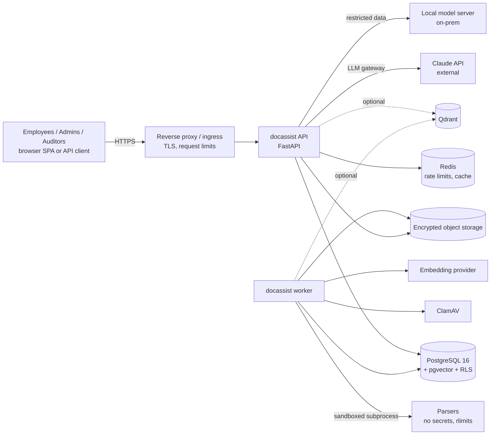
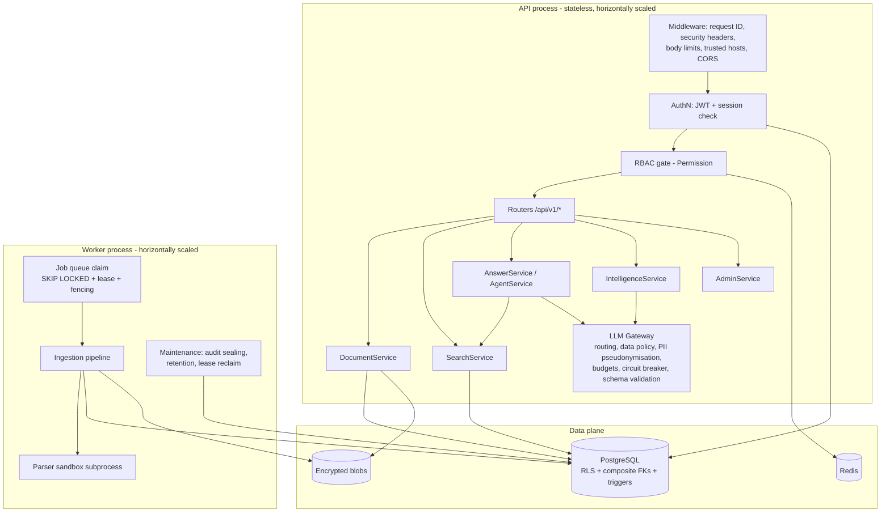
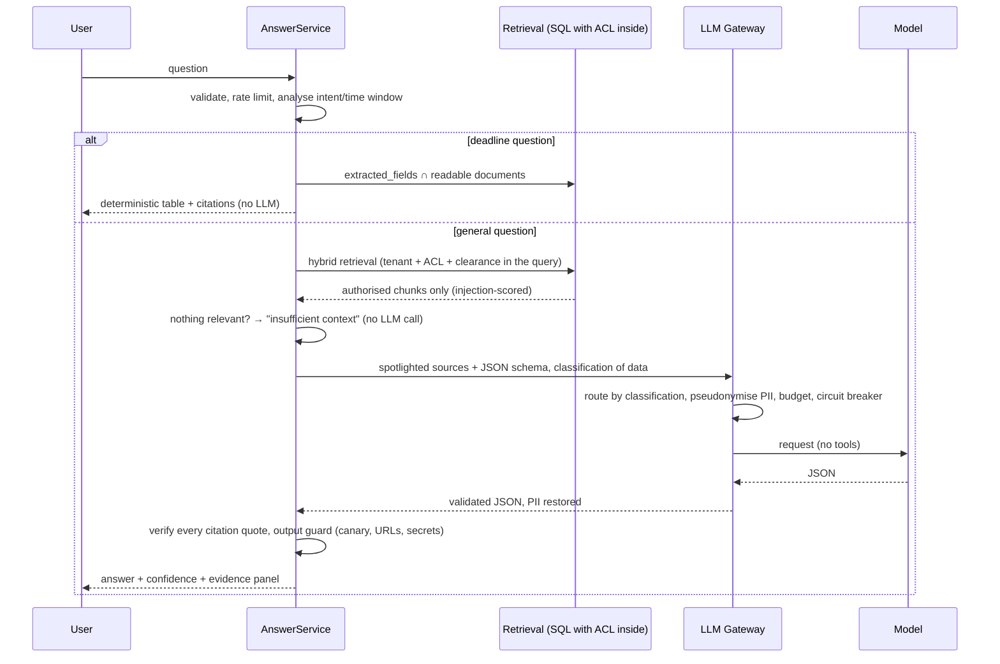

# Architecture (Level 1 — Requirements and Enterprise Architecture)

This document describes **what** the AI Document Assistant must do, **how** it is built, and
**why** each architectural decision was taken. The threat model lives in
[`threat-model.md`](threat-model.md); the control catalogue in
[`security-architecture.md`](security-architecture.md).

---

## 1. Objective

Organisations store thousands to millions of contracts, invoices, policies and technical
documents. Employees need to *find* information, *ask questions* about it and *extract*
structured facts (deadlines, payment terms, parties) — without ever seeing documents they
are not entitled to, and without leaking sensitive text to third parties.

The platform therefore combines three things that are usually built separately:

| Pillar | Capabilities |
|---|---|
| **Document AI** | secure ingestion, parsing, OCR hook, chunking, classification, sensitivity detection, field extraction, summaries, version comparison |
| **Retrieval & RAG** | keyword (PostgreSQL FTS), semantic (pgvector / Qdrant), hybrid RRF + rerank + MMR, grounded answers with verified citations, bounded tool-using agent |
| **Enterprise controls** | multi-tenancy with database-enforced isolation, RBAC + document ACL, MFA, audit hash chain, data governance for LLM traffic, rate limits, quotas, retention |

## 2. Requirements

### 2.1 Functional

| ID | Requirement | Where |
|---|---|---|
| F-1 | Authenticated users upload PDF, DOCX, XLSX, CSV, TXT, MD | `documents/service.py` |
| F-2 | Files are validated, scanned, encrypted and stored; processing is asynchronous | `documents/`, `ingestion/`, `jobs/` |
| F-3 | Text, structure (headings, tables, pages) and metadata are extracted in a sandbox | `ingestion/sandbox*.py`, `ingestion/parsers/` |
| F-4 | Documents are classified by type; sensitivity signals may **raise** (never lower) the suggested classification | `ingestion/classify.py`, `ingestion/sensitivity.py` |
| F-5 | Chunks keep page/section/heading metadata for exact citations | `ingestion/chunking.py` |
| F-6 | Keyword, semantic and hybrid search with filters | `search/` |
| F-7 | Questions are answered only from authorised documents, with verified citations and a confidence score; unsupported questions are declined | `rag/service.py`, `rag/citations.py` |
| F-8 | Summaries, version comparison, deadline detection, contract/invoice extraction, reports | `intelligence/` |
| F-9 | Document versions; old versions searchable only on request | `documents/`, `search/` |
| F-10 | Document-, department-, role- and classification-level permissions + explicit grants | `authz/policy.py` |
| F-11 | Multi-tenant administration (organisations, departments, users, roles) | `identity/admin.py` |
| F-12 | Complete, tamper-evident audit trail; exports are audited and expire | `audit/`, `intelligence/exports.py` |

### 2.2 Non-functional (priority order from the brief)

1. **Security** — defence in depth; every layer assumes the one above it can fail.
2. **Data isolation** — a tenant can never read another tenant's rows, vectors, metadata,
   conversations or audit records, *even if application code has a bug*.
3. **Correctness** — answers are grounded; citations are machine-verified; deterministic
   paths (deadlines) do not use an LLM at all.
4. **Reliability** — no lost jobs (transactional outbox), retries with backoff, dead letters,
   graceful degradation when Redis / the embedder / the LLM are down.
5. **Business value** — the common enterprise questions ("which contracts expire in 90
   days?", "what are the payment terms?") are first-class features, not prompts.
6. **Scalability** — stateless API, horizontally scalable workers, keyset pagination,
   HNSW indexes, optional Qdrant for very large corpora.
7. **Maintainability** — modular monolith with import boundaries enforced in CI.
8. **Observability** — structured logs with correlation IDs, Prometheus metrics, health
   probes, LLM cost and token accounting.
9. **Cost efficiency** — model routing (fast vs main tier), prompt caching, answer cache,
   no LLM call when retrieval finds nothing, per-organisation token budgets.

## 3. System context



## 4. Logical architecture

The brief proposed an API gateway → auth → document/AI services layout. The implemented
design keeps that shape but makes two changes that matter for security:

1. **Authorization is not a layer "in front of" services — it is compiled into every data
   access.** A gateway that checks "may this user search?" cannot know which *rows* the user
   may see. The document ACL is therefore expressed once (`authz/policy.py`) and embedded in
   every SQL query that touches documents, chunks, vectors or extracted fields, and
   PostgreSQL row-level security enforces the tenant boundary underneath it.
2. **The LLM sits behind a gateway that owns data governance**, and the RAG path gives the
   model no tools at all. Security does not depend on the model obeying instructions.



### 4.1 Module responsibilities

| Package | Responsibility | Must not depend on |
|---|---|---|
| `core` | settings, enums, errors, Unicode hygiene, PII/secret redaction, logging | any feature module |
| `db` | ORM models, RLS-scoped sessions | API layer |
| `security` | Argon2id, JWT, envelope encryption, TOTP, SSRF guard | FastAPI, DB |
| `authz` | permission matrix, principal, document policy (Python + SQL) | API layer |
| `audit` | transactional audit logging, HMAC chain sealing/verification, LLM usage recording | API layer |
| `cache` | encrypted Redis cache, GCRA rate limiter | API layer |
| `jobs` | outbox queue, handler registry, worker, maintenance | API layer |
| `identity` | authentication, sessions, MFA, administration | API layer |
| `documents` | upload validation, scanning, storage, versions, grants | API layer |
| `ingestion` | sandboxed parsing, normalisation, chunking, injection scanning, classification, extraction | secrets, DB inside the sandbox |
| `embeddings` | provider abstraction | DB |
| `search` | vector stores, keyword, hybrid ranking, search service | API layer |
| `llm` | provider abstraction + gateway | **DB, storage, API** (so a compromised prompt path cannot reach data directly) |
| `rag` | query analysis, secure context, answers, citations, guard, agent tools | API layer |
| `intelligence` | summaries, comparisons, deadlines, extraction, reports, exports | API layer |
| `api` | HTTP only: routers, middleware, dependencies, problem responses | — |

These boundaries are enforced by **import-linter contracts** in `pyproject.toml` and run in CI.

## 5. Key flows

### 5.1 Upload and ingestion

```mermaid
sequenceDiagram
    participant C as Client
    participant A as API
    participant DB as PostgreSQL
    participant S as Storage
    participant W as Worker
    participant X as Sandbox
    C->>A: POST /documents (multipart)
    A->>A: authn, RBAC, rate limit, stream to private temp file,<br/>size cap, SHA-256, magic sniffing, zip inspection,<br/>active-content + malware scan
    A->>S: encrypt (per-object DEK, context-bound)
    A->>DB: BEGIN; document + version + ingest job + audit; COMMIT
    A-->>C: 202 {document_id, status}
    W->>DB: claim job (FOR UPDATE SKIP LOCKED, lease)
    W->>S: decrypt
    W->>X: plaintext via stdin (no secrets, rlimits, timeout)
    X-->>W: validated JSON structure
    W->>W: normalise, sensitivity, classify, chunk,<br/>injection-score, embed (policy-aware), extract fields
    W->>DB: BEGIN; chunks + embeddings + fields + status + audit; COMMIT
```

### 5.2 Grounded question answering



## 6. Architecture decisions (ADRs)

### ADR-01 Modular monolith, two process types
One codebase, two deployables (API, worker). Microservices would add network hops and
distributed-transaction problems without benefit at this scale; the import-linter contracts
give the modularity. Both processes scale horizontally and hold no local state.

### ADR-02 PostgreSQL row-level security for tenant isolation
*Options:* database per tenant, schema per tenant, shared schema + RLS.
*Decision:* shared schema, `organization_id` on every tenant row, **RLS policies on every
tenant table**, transaction-local context (`set_config(..., is_local => true)`) set right
after `BEGIN`, and the API connecting as a role **without** `BYPASSRLS`, superuser or table
ownership (verified at start-up). Missing context → policies return no rows (fail closed).
*Why:* one schema scales to thousands of tenants and keeps migrations simple, while the
database — not application code — guarantees isolation. Composite foreign keys
`(organization_id, parent_id)` additionally make cross-tenant references impossible.
Database-per-tenant remains an option for regulated customers (same code, different DSN).

### ADR-03 Three database roles
Schema owner (migrations only), `docassist_app` (API: DML, RLS, cannot delete audit rows or
hard-delete documents), `docassist_worker` (claims jobs across tenants, seals audit, purges
per retention). Login-time lookups that must work before the tenant is known use four narrow
`SECURITY DEFINER` functions returning identifiers only, with a pinned `search_path`.

### ADR-04 pgvector by default, Qdrant optional
*Decision:* embeddings live in PostgreSQL (`chunk_embeddings`, HNSW index) as the system of
record. The ACL predicate runs **in the same SQL statement** as the vector search, so a
permission change or a deletion is effective in the same transaction — no index lag.
Qdrant is supported for very large corpora: points carry authorization payload and are
pre-filtered in Qdrant, **then every hit is re-verified in PostgreSQL** with the same policy,
so a stale payload can never leak a document. Qdrant is rebuilt from PostgreSQL at any time.

### ADR-05 PostgreSQL job queue instead of Celery
Jobs are inserted in the *same transaction* as the business change (transactional outbox),
claimed with `FOR UPDATE SKIP LOCKED`, protected by leases + fencing tokens, retried with
exponential backoff and dead-lettered. No broker to secure, no dual-write problem, and job
status is queryable with the same RLS guarantees.

### ADR-06 Parsers run in a separate, secret-free subprocess
Parsers process attacker-controlled bytes and have a history of CVEs. The worker pipes
plaintext into a child process that has no environment secrets, no database connection, a
private temp directory, CPU/memory/file-size/file-descriptor limits (POSIX), a wall-clock
timeout and (on Linux, best effort) no network namespace. Only schema-validated JSON comes
back. In containers the worker additionally has no egress except the configured providers.

### ADR-07 Envelope encryption at the application layer
Every stored object has its own AES-256-GCM data key, wrapped by a rotatable key-encryption
key, and its ciphertext is bound to `organization + object kind + object id`. Copying a blob
onto another record, truncating or reordering it fails authentication. This protects
against storage-level compromise and misconfigured buckets independently of provider-side
encryption.

### ADR-08 LLM gateway with data governance
All model traffic goes through one gateway that (1) routes by task to a fast or main model,
(2) decides by data classification whether an **external** provider may see the data at all
(default ceiling: CONFIDENTIAL; RESTRICTED goes only to a local/on-prem model or not at all),
(3) pseudonymises PII before external calls and restores it afterwards, (4) enforces rate
limits, monthly token budgets and a circuit breaker, (5) validates structured output
against a JSON schema, (6) records tokens, latency and cost. Providers are swappable:
Claude (official SDK), any OpenAI-compatible local server, and an offline extractive
provider for development and tests. The same classification ceiling applies to embeddings.

### ADR-09 Security of the RAG path does not rely on the prompt
Prompt instructions are one layer. The architectural controls are: retrieval is authorised
before the model sees anything; the answering model has **no tools** and no network; sources
are delimited with a per-request random nonce and escaped so documents cannot close their
container; chunks are injection-scored at ingestion and high-risk chunks are excluded;
citations must quote the source verbatim (checked in code); output is filtered for the
system-prompt canary, foreign URLs, images and secrets. See the threat model for the
residual risk.

### ADR-10 Deterministic answers where determinism is possible
"Which contracts expire in the next 90 days?" is answered from `extracted_fields` with SQL
over readable documents — exact, cheap and citable. The LLM is used for language, not for
arithmetic over dates.

### ADR-11 Stateless JWT + stateful session
Access tokens are short-lived (10 min) JWTs, but each carries a session id checked on every
request, so logout, password change, role change and account disable take effect
immediately. Refresh tokens are opaque, stored as peppered HMACs, single-use, rotated, with
reuse detection that revokes the whole session.

### ADR-12 Tamper-evident audit with an HMAC chain
Audit rows are written transactionally, protected by privileges and triggers (append-only),
and sealed into per-organisation HMAC chains by the worker. The HMAC key is not in the
database, so even a DBA who bypasses triggers cannot forge a consistent chain; verification
is an API call for auditors.

## 7. Technology choices

| Concern | Choice | Security notes |
|---|---|---|
| API | FastAPI + Pydantic v2 | strict schemas (`extra="forbid"`), validation errors never echo input |
| DB | PostgreSQL 16, SQLAlchemy 2 async, asyncpg, Alembic | parameterised queries only; statement/lock/idle timeouts per connection |
| Vectors | pgvector (HNSW, cosine) / Qdrant | ACL in-query; Qdrant hits re-verified |
| Cache / limits | Redis | namespaced hashed keys, encrypted values, TTLs, `volatile-lru`, ACL user |
| PDF | pypdf | pure Python (no native renderer); page caps; sandboxed |
| DOCX | python-docx | lxml with entity resolution disabled; zip inspected first |
| XLSX | openpyxl (read-only, data-only) + defusedxml | defusedxml blocks billion-laughs/XXE; row/cell caps |
| CSV/TXT | stdlib | field-size and row caps, encoding sniffed safely |
| Crypto | `cryptography` (AES-GCM), argon2-cffi, PyJWT | algorithms pinned, keys rotated by id |
| LLM | `anthropic` SDK (Claude Opus 5.5 / Haiku 4.5), OpenAI-compatible local server | gateway-only access, no tools in RAG |
| Logs / metrics | structlog JSON, prometheus-client | redaction processor, low-cardinality labels |

Deliberately **not** used: PyMuPDF (AGPL, native code), LangChain-style frameworks (large
dependency surface, implicit tool execution), pickle-based serialisation anywhere.

## 8. Scalability

| Bottleneck | Strategy |
|---|---|
| API CPU | stateless replicas behind the ingress; Argon2 cost tuned per hardware |
| Ingestion throughput | add worker replicas; parser concurrency per worker; batch embeddings |
| Vector search latency | HNSW (`ef_search` tunable); iterative scans on pgvector ≥ 0.8; Qdrant beyond ~50 M chunks |
| Keyword search | GIN index on generated `tsvector` (weighted headings) |
| Database connections | pooled engines per process; PgBouncer in transaction mode is compatible (context is transaction-local) |
| Hot tenants | per-organisation rate limits and LLM budgets; partitioning `document_chunks` by organisation hash is a drop-in change |
| LLM cost/latency | fast-tier routing, prompt caching of the stable system prompt, encrypted answer cache keyed by the exact authorised context, no call when retrieval is empty |

## 9. Deployment topology

See `compose.yaml` (single host) and `deployment/kubernetes/` (production): the API is the
only component on the edge network; PostgreSQL, Redis, Qdrant and ClamAV live on an internal
network with no egress; only the API and worker may reach the configured LLM/embedding hosts.
All containers run as non-root with read-only root filesystems and all Linux capabilities
dropped.
