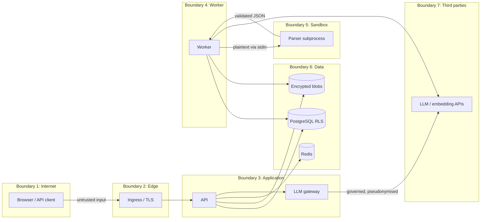

# Threat Model (Level 2)

Method: data-flow diagram → trust boundaries → STRIDE per component → threat register with
controls, detection, tests and residual risk → mapping to OWASP API Security Top 10 (2023),
OWASP Top 10 (2021) and OWASP Top 10 for LLM Applications (2025).

The companion document [`security-architecture.md`](security-architecture.md) lists every
control by layer; this document explains which threat each control exists for.

---

## 1. Assets

| Asset | Why it matters | Classification |
|---|---|---|
| Document content (files, chunks, embeddings, extracted fields) | contracts, salaries, HR cases, trade secrets | up to RESTRICTED |
| Document metadata (titles, owners, departments, existence) | titles alone can leak ("Layoff plan Q4") | same as the document |
| Conversations and AI answers | contain document content, reveal intent | owner only |
| Credentials, sessions, refresh/reset/MFA tokens | account takeover | secret |
| Application secrets (JWT key, token pepper, KEKs, audit HMAC key, provider API keys) | total compromise | secret |
| Audit trail | accountability, forensics, compliance | integrity-critical |
| Organisation budget (LLM tokens), availability | cost, service continuity | — |

## 2. Actors

| Actor | Capability | Typical goal |
|---|---|---|
| A1 Anonymous internet attacker | HTTP requests to the edge | account takeover, RCE, data theft, DoS |
| A2 Authenticated user of tenant X | valid session, uploads, prompts | read other departments' or tenants' data, escalate role |
| A3 Malicious document author | controls text inside a document someone uploads | indirect prompt injection, exfiltration, parser exploit |
| A4 Compromised / misbehaving model | controls LLM output | leak data, induce harmful actions, fake citations |
| A5 Organisation admin gone rogue | admin API in own tenant | read RESTRICTED content, cover tracks |
| A6 Platform operator / DBA | infrastructure access | read tenant content, tamper with audit |
| A7 Supply-chain attacker | a dependency, base image or CI action | code execution in build or runtime |

## 3. Data-flow diagram and trust boundaries

Every arrow that crosses a boundary carries untrusted data in at least one direction:
user input into the API, document bytes into the sandbox, parser output back into the
worker, model output back into the application.

## 4. STRIDE by component

### 4.1 Authentication and sessions
| STRIDE | Threat | Controls |
|---|---|---|
| S | credential stuffing, brute force | per-IP + per-account GCRA limits; exponential lockout; Argon2id; MFA (TOTP) |
| S | JWT forgery (`alg=none`, key confusion, foreign issuer) | HS256 pinned on verification, `kid`-selected key, `iss`/`aud`/`exp`/`nbf`/`jti`/`sid` required |
| S | stolen refresh token | single-use rotation; reuse revokes the whole session; HttpOnly SameSite=Strict `__Host-` cookie; CSRF header required |
| T | tampering with role/org claims | claims re-checked against the DB user row on every request (`role`, `org`, `token_version`) |
| R | "I never logged in" | `auth.login`, `auth.login_failed`, `auth.refresh_token_reuse_detected` audited with anonymised IP |
| I | user enumeration | identical error and Argon2 work for unknown, wrong-password, disabled and locked accounts; reset endpoint always 202 |
| D | Argon2 as a DoS amplifier | rate limits before hashing; body size limits |
| E | session survives password change / role change | `token_version` bump + session revocation |

### 4.2 Authorization and multi-tenancy
| STRIDE | Threat | Controls |
|---|---|---|
| E | IDOR on documents, versions, grants, exports, conversations | ACL compiled into SQL; invisible → 404; conversations restricted to the owner *by RLS* |
| E | cross-tenant read through an application bug | PostgreSQL RLS on every tenant table, fail-closed context, app role without BYPASSRLS (start-up check) |
| T | cross-tenant write / moving a row to another tenant | RLS `WITH CHECK`; composite FKs `(organization_id, id)` |
| E | privilege escalation via admin API | assignable-role matrix, no clearance above own, no self-modification, last-admin protection, platform admins not creatable by tenants |
| I | platform operator reads tenant content through the app | no RLS policy on content tables has a platform clause |
| E | Python and SQL policy drift | differential test over random organisations (`tests/integration/test_policy_equivalence.py`) |

### 4.3 Upload and document storage
| STRIDE | Threat | Controls |
|---|---|---|
| T/E | malicious file (macro, PDF JavaScript, launch actions, polyglot) | magic-byte sniffing, extension must match, macro content types rejected, active-content scanner, ClamAV INSTREAM, quarantine |
| D | zip bomb / decompression bomb / billion laughs | zip metadata inspection (entries, total size, ratio, nesting), defusedxml, openpyxl read-only |
| T | path traversal through filenames | filenames are display-only; object keys are server-generated; storage re-checks paths stay under the root |
| I | storage compromise (disk, bucket, backup) | per-object AES-256-GCM data keys, KEK wrapping, context binding |
| T | blob swapping between records / tenants | AAD binds ciphertext to organisation + kind + id |
| I | duplicate detection reveals hidden documents | duplicates reported only when the uploader can list the existing document |

### 4.4 Parsing, OCR and ingestion
| STRIDE | Threat | Controls |
|---|---|---|
| E | parser RCE | subprocess with no secrets in env, isolated mode (`python -I`), rlimits (POSIX), timeout, network namespace (Linux, best effort), container with no egress |
| D | parser hang / memory blow-up | wall-clock timeout + kill, RLIMIT_AS/CPU, page/row/cell caps, output size cap |
| T | parser output crafted to break the worker | strict schema validation of the JSON result |
| T | poisoned content / hidden instructions (A3) | Unicode tag/bidi/zero-width stripping (hidden payload decoded for scanning), injection scoring per chunk |
| I | sensitive content under-classified | sensitivity detector suggests (never lowers) a higher classification; audited |

### 4.5 Search and retrieval
| STRIDE | Threat | Controls |
|---|---|---|
| I | vector similarity returns unauthorised chunks | ACL + tenant + clearance + current-version rule in the same SQL statement as the vector ranking |
| I | stale permissions in an external vector index | Qdrant pre-filter **and** PostgreSQL re-verification of every hit |
| I | deleted document still retrievable | chunks/embeddings/fields deleted in the delete transaction; external index purge job |
| I | titles/snippets of unauthorised documents in results | results are built only from authorised rows; snippets plain text |
| T | SQL injection through query or filters | bound parameters only; `websearch_to_tsquery`; typed filters |
| D | expensive queries | length limits, `limit ≤ 50`, statement timeout, rate limit |

### 4.6 RAG, LLM gateway and agent
| STRIDE | Threat | Controls |
|---|---|---|
| T | direct prompt injection (user) | question scanned and flagged; retrieval scope fixed server-side, so instructions cannot widen access |
| T | indirect injection (document) | nonce-delimited, escaped sources; injection-scored chunks excluded above threshold; RAG model has **no tools** |
| I | system-prompt extraction | per-deployment canary in the system prompt; output containing it is blocked |
| I | exfiltration through output (markdown image, links) | output guard strips images/HTML and URLs not present in sources; UI renders text only; CSP `img-src 'self'` |
| I | sensitive data sent to a third-party model | classification ceiling for external providers (default CONFIDENTIAL), RESTRICTED → local model or excluded, PII pseudonymisation, same rule for embeddings |
| T | hallucination / fabricated citations | citations must quote the source verbatim (checked in code); unverified → dropped; no valid citation → "insufficient context" |
| E | excessive agency (tool abuse) | read-only tools, strict schemas (`extra=forbid`), principal-scoped execution, iteration/tool-call caps, per-tool timeouts and rate limits, audit |
| D | unbounded consumption / cost attacks | per-user and per-org rate limits, monthly token budgets, context/output token caps, circuit breaker |

### 4.7 Worker, jobs, Redis
| STRIDE | Threat | Controls |
|---|---|---|
| T | job payload tampering | payloads contain IDs only; handlers reload state under RLS |
| D | poison job loops | permanent errors dead-lettered immediately; bounded attempts with backoff |
| T | zombie worker overwrites result | lease + fencing (`locked_by = me AND status = running`) |
| I | Redis snapshot leaks content | hashed keys; content-bearing values encrypted; ACL user; no persistence required |
| D | Redis outage disables rate limiting | in-process GCRA fallback (no fail-open) |

### 4.8 Audit, exports and administration
| STRIDE | Threat | Controls |
|---|---|---|
| R/T | audit tampering by a rogue admin or DBA | app role cannot UPDATE/DELETE; trigger blocks edits and TRUNCATE; HMAC chain with key outside the DB; verify endpoint |
| I | bulk extraction via export | permission, rate limit, row caps, readable-scope only, audited, expiring encrypted blobs, single-use signed links |
| T | CSV formula injection in exported files | cells starting with `= + - @ \t \r` are prefixed |
| E | org admin reads RESTRICTED content silently | admins manage but do not read RESTRICTED without a grant; granting is an audited permission change |

### 4.9 Supply chain and delivery
| Threat | Controls |
|---|---|
| malicious/vulnerable dependency | minimal dependency set, lower+upper bounds, lock file, `pip-audit`, Dependabot |
| compromised CI action | actions pinned by commit SHA, `permissions: contents: read` by default |
| vulnerable base image | slim image, Trivy scan in CI, rebuild on Dependabot docker updates |
| secret committed | gitleaks in CI and pre-commit; `.env` ignored; secrets only via files / secret stores |

## 5. Threat register

Likelihood/Impact: L = low, M = medium, H = high. Residual risk after controls.

| ID | Threat | Vector | Impact | Lik. | Control | Detection | Test | Residual |
|---|---|---|---|---|---|---|---|---|
| T01 | Cross-tenant data read | missing `WHERE org` in new code | H | M | RLS on all tenant tables, fail-closed context | none needed: the DB returns nothing | `test_rls_isolation.py` | L |
| T02 | Cross-department read | IDOR on `/documents/{id}` | H | H | ACL in SQL, 404 for invisible | `authz.denied` audit on RBAC failures | `tests/security/`, `test_policy_equivalence.py` | L |
| T03 | Vector search bypasses ACL | nearest-neighbour over all rows | H | M | ACL inside the vector query; Qdrant re-verify | — | search security tests | L |
| T04 | Credential stuffing | leaked password lists | H | H | rate limits, lockout, MFA, Argon2id | `auth_events_total`, lockout audit | `test_auth_api.py::test_account_lockout` | M (users without MFA) |
| T05 | Refresh token theft | XSS / device theft | H | M | HttpOnly cookie, CSP + Trusted Types, rotation + reuse detection | `refresh_token_reuse_detected` | `test_refresh_rotation_and_reuse_detection` | L |
| T06 | JWT forgery | alg confusion | H | L | algorithm pinning, kid map | 401 metrics | `test_security_tokens.py` | L |
| T07 | Malicious upload executes | macro / PDF JS | H | M | sniffing, scanners, quarantine, never executed | `security_events_total{kind}` | upload security tests | L |
| T08 | Parser RCE | crafted PDF/XLSX | H | L | sandbox subprocess, no secrets, rlimits, no egress | job failures, sandbox errors | ingestion tests | M (native code in deps) |
| T09 | Decompression bomb | zip/XML bombs | M | M | zip inspection, defusedxml, caps | parse_timeout codes | upload security tests | L |
| T10 | Indirect prompt injection | text in a document | H | H | spotlighting, injection scoring + exclusion, no tools, output guard | `security_events_total{kind="injection_detected"}` | `tests/adversarial/` | M (semantic manipulation of answer wording remains possible) |
| T11 | Data exfiltration via output | markdown image to attacker URL | H | M | URL/image stripping, text-only UI, CSP | guard metrics | adversarial tests | L |
| T12 | System prompt leakage | "print your instructions" | L | H | canary detection, no secrets in prompts | `prompt_leak` events | adversarial tests | L |
| T13 | Sensitive data to external LLM | RESTRICTED chunk in context | H | M | classification routing, pseudonymisation | gateway policy denials | gateway tests | L |
| T14 | Hallucinated answer | model invents facts | M | M | retrieval-required, verified quotes, insufficient-context path, confidence | `citations_total{outcome="invalid"}` | evaluation harness | M |
| T15 | Excessive agency | agent calls tools with forged ids | H | M | principal-bound tools, schemas, caps | tool-call audit | agent tests with scripted malicious model | L |
| T16 | Cost exhaustion | scripted question flood | M | M | rate limits + monthly budgets + token caps | usage dashboard | gateway budget tests | L |
| T17 | SSRF | URL import / provider base URL | H | M | allowlist, IP classification, DNS pinning, per-hop redirects | egress denials logged | `test_security_ssrf.py` | L |
| T18 | SQL injection | search box, filters | H | L | ORM/bound params only; bandit in CI | 500 rate | search security tests | L |
| T19 | Stored XSS | document titles, answers | H | M | JSON API, DOM text-only UI, CSP with Trusted Types `'none'` | CSP reports | `test_web_assets.py` | L |
| T20 | Audit tampering | DBA edits rows | M | L | triggers, privileges, HMAC chain | `/audit/verify` | `test_audit_chain.py` | L (deletion of *unsealed* rows in the seconds before sealing by a superuser) |
| T21 | Bulk export abuse | insider exports everything | H | M | caps, rate limits, audit, expiry | export audit events | export tests | M (authorised insiders can still copy what they may read) |
| T22 | Rogue org admin reads HR | admin role | H | L | no implicit RESTRICTED read; grant is audited | permission-change audit | policy tests | M (admin can grant themselves; detectable, not preventable) |
| T23 | Secret leakage in logs | tokens in headers/errors | H | M | redaction processor, validation errors without input | log review | `test_weak_password_rejected_without_echo` | L |
| T24 | Account takeover via reset | token guessing/replay | H | L | 256-bit single-use peppered tokens, 30 min TTL, sessions revoked | reset audit | `test_password_reset_flow` | L |
| T25 | Deleted data remains searchable | index lag | M | M | in-transaction deletion; purge jobs; retention | — | document deletion tests | L |
| T26 | Backup exposure | stolen dump | H | L | app-layer encryption of blobs + MFA secrets; tokens hashed; KEKs outside backups | — | crypto tests | M (DB rows such as chunk text are only protected by storage/backup encryption) |
| T27 | Denial of service | large bodies, slow parsing | M | M | body limits (header and streamed), timeouts, queue isolation | latency metrics | middleware tests | M |
| T28 | Dependency / CI compromise | poisoned package or action | H | L | pins, SHA-pinned actions, audits, SBOM | Dependabot, Trivy | CI | M |

## 6. OWASP API Security Top 10 (2023)

| Risk | Mitigation in this system |
|---|---|
| API1 Broken Object Level Authorization | ACL in SQL for every object type; RLS; 404 for invisible objects; conversations owner-only in RLS |
| API2 Broken Authentication | Argon2id, lockout, rate limits, MFA, short JWTs bound to revocable sessions, refresh rotation + reuse detection |
| API3 Broken Object Property Level Authorization | strict Pydantic input models (`extra="forbid"`), explicit response models, manager-only fields (findings, grants) |
| API4 Unrestricted Resource Consumption | GCRA rate limits per user/IP/org, body limits, pagination caps, token budgets, parser limits, timeouts |
| API5 Broken Function Level Authorization | RBAC `require(Permission)` on every route; auditors read-only; platform vs tenant separation |
| API6 Unrestricted Access to Sensitive Business Flows | export caps + audit, upload limits, LLM budgets, reset/login throttles |
| API7 Server Side Request Forgery | egress allowlist, private-range blocking, DNS pinning, redirect re-validation, size/type caps |
| API8 Security Misconfiguration | production settings validator refuses unsafe config; security headers; docs disabled in production; hardened containers |
| API9 Improper Inventory Management | versioned `/api/v1`, OpenAPI only outside production, single router registry |
| API10 Unsafe Consumption of APIs | LLM/embedding responses validated (schemas, dimensions, finiteness), timeouts, circuit breaker, no trust in model output |

## 7. OWASP Top 10 (2021)

| Risk | Mitigation |
|---|---|
| A01 Broken Access Control | RBAC + ACL-in-SQL + RLS + composite FKs |
| A02 Cryptographic Failures | AES-256-GCM envelope encryption, Argon2id, HMAC-hashed tokens, TLS enforced in production |
| A03 Injection | parameterised SQL, no shell, no eval, DOM-safe UI, prompt spotlighting |
| A04 Insecure Design | threat model, fail-closed defaults, deterministic paths for exact questions |
| A05 Security Misconfiguration | settings validator, container hardening, CSP |
| A06 Vulnerable Components | pip-audit, Dependabot, Trivy, minimal dependency set |
| A07 Identification & Authentication Failures | see API2 |
| A08 Software & Data Integrity Failures | SHA-pinned CI actions, signed-off lockfile, HMAC audit chain, AEAD for stored data |
| A09 Logging & Monitoring Failures | structured logs, audit trail, Prometheus metrics, security event counters |
| A10 SSRF | see API7 |

## 8. OWASP Top 10 for LLM Applications (2025)

| Risk | Mitigation |
|---|---|
| LLM01 Prompt Injection | architectural: retrieval authorised before the model, no tools in RAG, nonce-delimited escaped sources, injection scoring/exclusion, output guard, citations verified in code |
| LLM02 Sensitive Information Disclosure | classification ceilings for external providers (LLM *and* embeddings), pseudonymisation, output secret redaction, logs never contain prompts/completions |
| LLM03 Supply Chain | official SDK only, pinned dependencies, no remote code/model loading |
| LLM04 Data and Model Poisoning | uploads are attributable and audited; injection-scored chunks; no fine-tuning on user data |
| LLM05 Improper Output Handling | output treated as untrusted text: schema-validated, sanitised, rendered with `textContent` only |
| LLM06 Excessive Agency | read-only tools, principal-bound, strict schemas, iteration and call caps, audit |
| LLM07 System Prompt Leakage | no secrets in prompts; canary detection |
| LLM08 Vector and Embedding Weaknesses | tenant/ACL filtering inside vector queries; Qdrant re-verification; embeddings deleted with documents; RESTRICTED text never embedded by external providers |
| LLM09 Misinformation | grounded answers only, verified quotes, confidence score, "insufficient context" answers, UI separates AI answer from source evidence |
| LLM10 Unbounded Consumption | rate limits, budgets, token caps, no LLM call when retrieval is empty, answer cache |

## 9. Assumptions and residual risks

* TLS is terminated by the ingress; the API trusts `X-Forwarded-For` only from configured proxy CIDRs.
* A PostgreSQL superuser can read every row. Mitigations: operational access controls,
  pgaudit (recommended), encrypted blobs; document *chunk text* in the database relies on
  storage encryption and backup encryption.
* Prompt injection cannot be eliminated, only contained: an injected document can still
  bias the wording of an answer about *documents the user is already allowed to read*. It
  cannot widen access, call tools, or exfiltrate through rendered output.
* The parser sandbox is strongest on Linux containers; on Windows development machines only
  the timeout and secret-free environment apply.
* E-mail addresses are platform-wide login identifiers, so an organisation admin creating a
  user can learn that an address is registered in *another* tenant (409). Every such probe is
  audited and user creation is rate-limited; organisation-qualified login would remove it.
* Organisation admins can grant themselves access to RESTRICTED documents; this is
  detectable in the audit trail, not preventable (separation of duties must be enforced by
  process, e.g. a second admin reviewing permission-change events).
